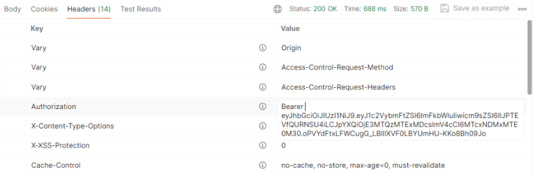
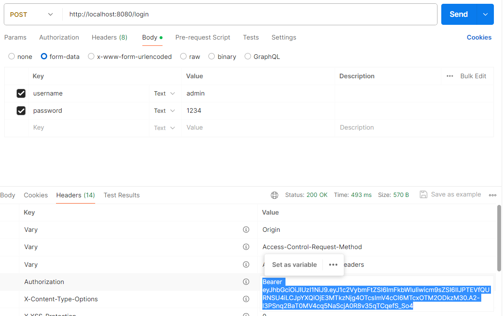
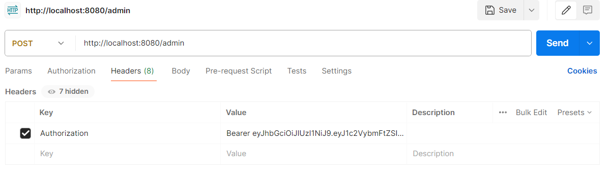
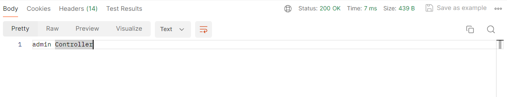
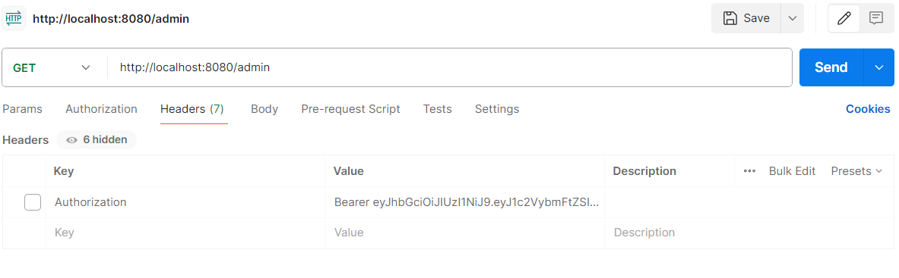
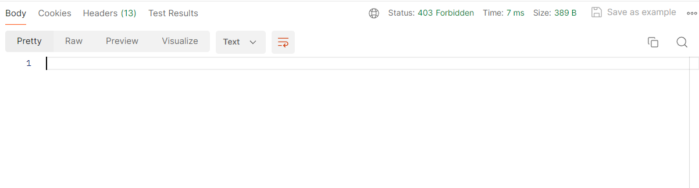
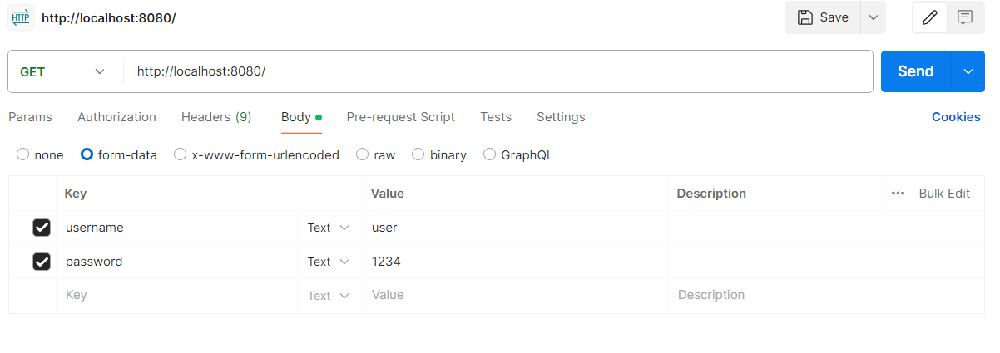
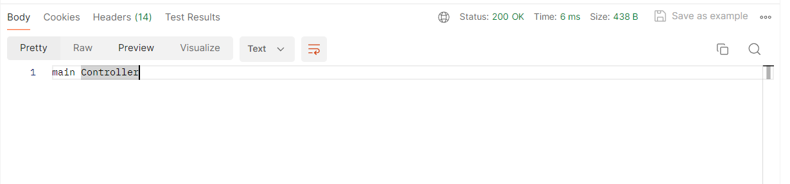
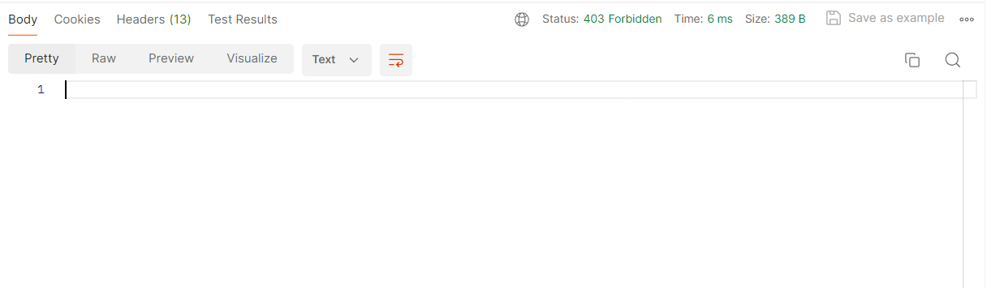

# SpringSecurity-JWT

### feat: 기본적인 SecurityConfig 설정
- JWT 방식에서는 세션을 STATELESS 상태로 관리한다!

---
### feat:DB연결 및 Entity 작성

- DB연결 완료

---
### feat: 회원가입 로직 구현

- POSTMAN으로 JSON데이터를 보내주면

- OK 문구가 뜨면서

- DB에 들어가게 된다.

컨트롤러에 @RequestBody를 붙여줘야지 JSON형태로 data를 보낼 수 있다.
Controller 메서드 인자에 @RequestBody 어노테이션 설정을 하지 않으면
Form-Data 형식으로 받도록 설정되어있다.

---
### feat: 로그인 필터 구현

- POSTMAN에 

- JSON형식으로 보내면

- 에러가 뜨게된다.

- 이유는 우리의 LoginFilter에서 MIME 타입을 form-data 형식으로 받도록 구현이 되어 있어서 그렇다.

- 그래서 form-data형식으로 보내면

- 이렇게 admin이 뜨게된다.

---
### feat: DB기반 로그인 검증

- POSTMAN에

- 이렇게  Body내부에 POST방식과 함께 username과 password값을 넘기면

- 응답 200 OK가 뜨고

- 로그인이 성공했을 때 출력되는 log도 잘 찍힌다.

---
### feat: JWT 발급 및 검증 클래스 작성

---
### feat: 로그인 성공 시 JWT 발급

- 응답코드 200과 함께 응답헤더에 Authorization이라는 키값에 대한 JWT값을 확인할 수 있다.

---
### feat: JWT 검증 필터 구현

- 발급 된 Authorization 키를 Header에 넣어준다.

- 그 후 admin 권한이 있어야지 접근할 수 있는 경로에 접근해보면

- 이렇게 정상적으로 접근 가능한것을 볼 수 있다.

- 헤더에 토큰을 해제하고 요청을 보내보면

- 403이 뜨면서 접근이 되지 않는다.

- 유저 권한을 가진 회원의 경우

- main 페이지에는 접근이 가능하지만

- admin 페이지 접근 시 오류가 뜬다.